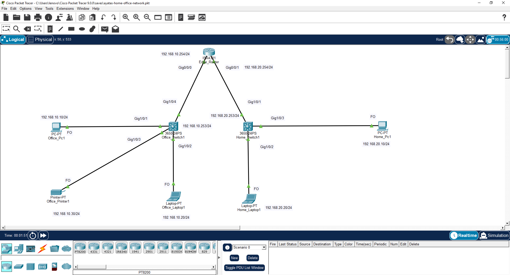

# Ayatas Home Office Network

A Cisco Packet Tracer project that simulates a small home office network. The project demonstrates basic network design, IPv4 addressing, switch management, remote administration, and end-to-end connectivity between office and home devices.

## Project Overview

A Cisco Packet Tracer project demonstrating a small home office network design. The objective was to design and configure a basic network that demonstrates fundamental networking concepts, including IPv4 addressing, switch management, router configuration, remote administration using Telnet, and end-to-end connectivity verification.

The project was created as part of my hands-on networking practice to strengthen my understanding of Cisco networking fundamentals and to build a technical portfolio.

## Network Scenario

This project simulates a small home office environment where business and personal devices are separated into different networks.

The office network contains a desktop computer, a laptop, and a network printer connected to a dedicated switch. The home network contains a desktop computer and a laptop connected to a separate switch.

Both switches are connected to an edge router, which provides communication between the two subnets and represents the connection to an Internet Service Provider (ISP).

The purpose of this design is to separate office and home devices into different subnets, creating a more organized and realistic network structure while demonstrating basic network segmentation.

## Network Topology

The following diagram illustrates the network topology implemented in this project.

## IP Addressing Plan

The network is divided into two separate private IPv4 subnets representing the office and home environments.

| Network | Subnet | Default Gateway | Switch Management IP | Connected Devices |
|----------|-----------------|-----------------|----------------------|-------------------|
| Office Network | 192.168.10.0/24 | 192.168.10.254 | 192.168.10.253 | PC, Laptop, Printer |
| Home Network | 192.168.20.0/24 | 192.168.20.254 | 192.168.20.253 | PC, Laptop |

### Addressing Design

- Two separate subnets were created to clearly separate office and home devices.
- The router interfaces use the last usable IP address (`.254`) in each subnet, making the default gateway easy to identify.
- The switches use `.253` as their management IP addresses to maintain a simple and consistent addressing scheme.
- End devices use easy-to-remember addresses (`.10`, `.20`, and `.30`) to simplify configuration, verification, and troubleshooting.

## Device Configuration

The following devices were configured as part of this project.

| Device | Configuration |
|----------|------------------------------------------------|
| Cisco ISR4331 Router | Interface IPv4 addressing, Loopback interface |
| Cisco Catalyst 3650 Switches | Hostname, Management IP (SVI), Default Gateway, Enable Password, Telnet (VTY) |
| Desktop PCs | Static IPv4 Address, Subnet Mask, Default Gateway |
| Laptops | Static IPv4 Address, Subnet Mask, Default Gateway |
| Network Printer | Static IPv4 Address, Subnet Mask, Default Gateway |

## Connectivity Tests

The following connectivity tests were successfully completed to verify the network configuration.

- Successful communication between devices within the Office Network.
- Successful communication between devices within the Home Network.
- Successful communication between the Office and Home networks through the router.
- Successful connectivity to the router interfaces.
- Successful connectivity to the switch management IP addresses.

All configured devices were able to communicate as expected, confirming that the IP addressing and routing configuration were functioning correctly.

## Technologies 

- Cisco Packet Tracer
- Cisco ISR4331 Router
- Cisco Catalyst 3650 Multilayer Switch
- IPv4 Addressing
- Static IP Configuration
- Cisco IOS CLI
- Telnet (VTY)
- Loopback Interface
  
## Lessons Learned

During this project, I gained hands-on experience with fundamental Cisco networking concepts, including:

- Configuring routers and switches using the Cisco IOS CLI.
- Assigning and verifying IPv4 addresses on network devices.
- Configuring switch management interfaces (SVIs) and default gateways.
- Understanding the purpose of loopback interfaces.
- Configuring remote access using Telnet (VTY).
- Verifying network connectivity using ping.
- Troubleshooting IP addressing and configuration mistakes.

## Future Improvements

The following features may be added in future versions of this project:

- Implement VLANs to separate network traffic.
- Configure Inter-VLAN Routing.
- Replace static IP addressing with DHCP.
- Add Access Control Lists (ACLs) to improve network security.
- Configure SSH for secure remote management instead of Telnet.
- Add DNS and DHCP servers.
- Implement dynamic routing protocols such as OSPF.
